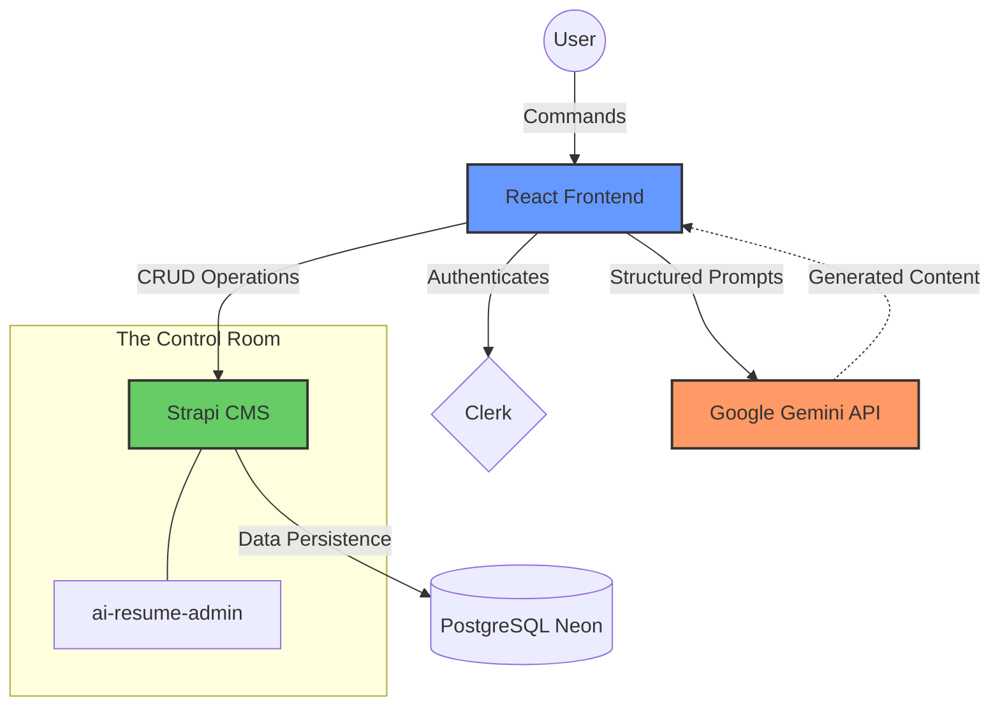

# 📄 AI Resume Builder: Crafting Futures with Intelligence

<div align="center">


</div>

---

## 🌟 The Vision

Traditional resume building is tedious. **AI Resume Builder** transforms this experience into a creative dialogue between you and machine intelligence. This isn't just a form-filler; it's a career architect that understands your professional journey and helps you articulate it to the world.

### ⚡ Power Features

- **🚀 AI Synthesis Engine:** Leverage Google Gemini to distill your experiences into punchy, ATS-optimized bullet points.
- **🎨 Visual Precision:** A sleek, dark-themed (or glassmorphic) UI that respects visual hierarchy.
- **🔄 Live Ecosystem:** Real-time persistence with Strapi and Neon PostgreSQL, ensuring your data is always synced.
- **💎 Premium WYSIWYG:** An editor that feels like a professional design tool, wrapped in a developer's simplicity.

---

## 🎬 Demo

<div align="center">

https://github.com/user-attachments/assets/104f0866-3a58-409c-a801-aaaabd3bcd75

</div>

---

## 🏗️ System Blueprint

The synergy between frontend, backend, and AI orchestrated in a modern serverless flow.



---

## 🧠 The "Magic" (How AI Works)

Instead of generic templates, we use **Context-Aware Prompting**. When you input your job title, our system coordinates with Gemini to understand industry standards and generates suggestions that match your specific seniority level and domain.

> [!TIP]
> **Pro Tip:** The more specific your input, the more tailored the AI response. Try including specific tech stacks in your experience description!

---

## 🔌 System Ecosystem

This repository is the "Face" of the project. To see the full internal machinery, you'll need the companion repository:

- 🖥️ **Frontend (This Repo):** User interface, editor, and AI integration.
- ⚙️ **Backend [ai-resume-admin](https://github.com/shekhawatmuskan/ai-resume-admin):** The Strapi-powered core handling user resumes, authentication data, and media assets.

---

## 🛠️ The Forge (Tech Stack)

| Component        | Technology            | Role                             |
| :--------------- | :-------------------- | :------------------------------- |
| **Framework**    | React + Vite          | Blazing fast development & HMR   |
| **Styling**      | Tailwind CSS / Shadcn | Design consistency & speed       |
| **Persistence**  | Strapi / Postgres     | Headless CMS flexibility         |
| **Intelligence** | Gemini Pro            | content synthesis & optimization |
| **Auth**         | Clerk                 | Production-ready user management |

---

## 🚀 Launch Sequence

<details>
<summary><b>1. Ignite the Engine (Clone)</b></summary>

```bash
git clone https://github.com/shekhawatmuskan/ai-resume-builder.git
cd ai-resume-builder
```

</details>

<details>
<summary><b>2. Load Fuel (Install)</b></summary>

```bash
npm install
```

</details>

<details>
<summary><b>3. Calibrate Systems (Environment)</b></summary>

Create `.env.local`:

```env
VITE_CLERK_PUBLISHABLE_KEY=...
VITE_STRAPI_API_KEY=...
VITE_STRAPI_BASE_URL=...
VITE_GEMINI_API_KEY=...
```

</details>

<details open>
<summary><b>4. Take Off!</b></summary>

```bash
npm run dev
```

Explore at `http://localhost:5173` 🚀

</details>

---

<br/>

<div align="center">

**If this project inspired you, give it a ⭐!**

[Check out my GitHub](https://github.com/shekhawatmuskan) | [Let's Connect](https://www.linkedin.com/in/muskan-shekhawat-327b27216/)

Built with passion and ☕ by [Muskan](https://github.com/shekhawatmuskan)

</div>
